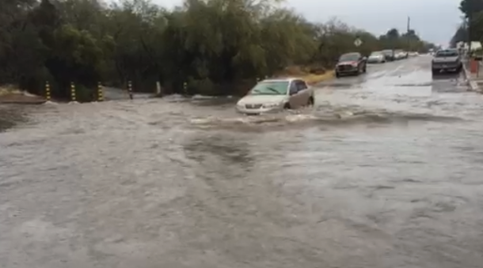
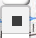
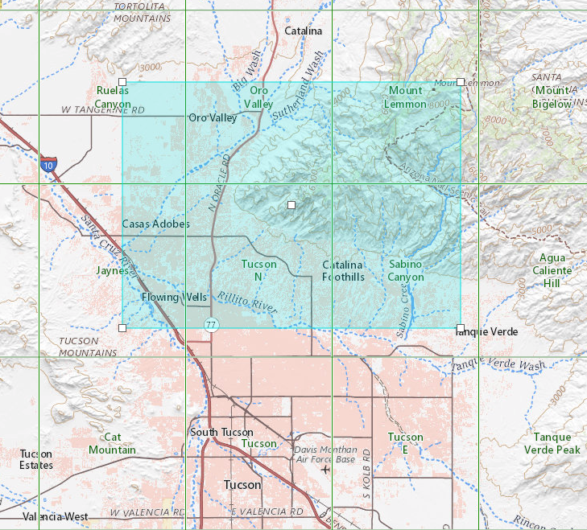
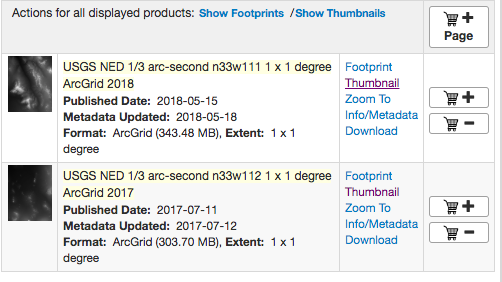
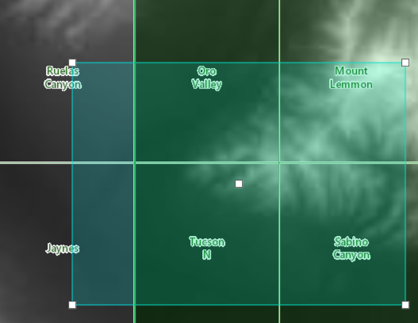
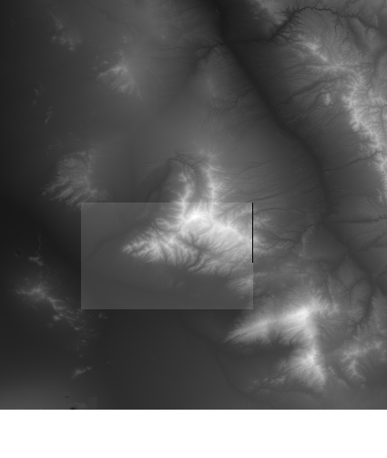
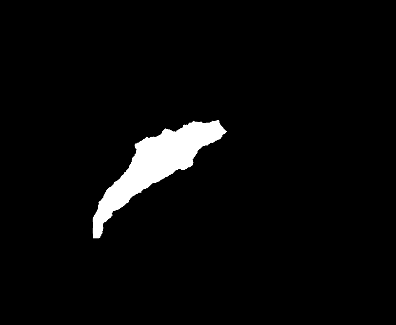

# Assignment: Watershed Delineation 
## Worth: 40 points
## Due: Tuesday, April 2, 11:59pm

## Assignment

### Overview

You're part of a rapid response team that is responsible for closing roads that are flooding. In an effort to prioritize 
road closures, you must identify the top ten locations at risk for flooding along River Road between West Orange Grove 
(-111.0474,32.3381) and North Sabino Canyon (-110.8390,32.2721). 

This assignment is Part I of your task and requires that you delineate a watershed and calculate its area in preparation 
for running hydrological models to simulate runoff from this and other watersheds that intersect River Road. 

### Background
QGIS has a powerful suite of tools for terrain analysis. It includes the full functionality of Grass GIS and SAGA, both 
available through the Processing Toolbox. 

Some resources related to the tools you will be using:
- https://docs.qgis.org/3.4/en/docs/training_manual/processing/hydro.html
- https://sagatutorials.wordpress.com/hydrological-flow-modelling/
- https://sagatutorials.wordpress.com/basic-terrain-analysis/
- https://gracilis.carleton.ca/CUOSGwiki/index.php/Exploring_Hydrological_Analyses_using_SAGA_GIS
- https://geogeek.xyz/catchment-delineation-with-qgis.html
- https://gisgeography.com/flow-direction/
- https://pvanb.wordpress.com/2010/03/15/esri-rasters-in-grass-or-qgis/

### Instructions
#### Acquire Elevation Data

1. Visit the USGS National Map https://viewer.nationalmap.gov/basic/ and zoom in to Tucson, AZ. 

2. Select `Elevation Products 3DEP` and select 1/3 arcsecond DEM. Toggle `Map Indices` on to see the green 
borders of the USGS DEM quadrangles. 

3. Click on the 

 `Draw Rectangle` 

box icon. Draw a rectangle around the Tucson foothills region, making sure to include Mount Lemmon in the upper right and extending far enough on the left to cross I-10. The footprint should look like this: 

4. Click on the Find Products button which should open the `Products` tab. If you have selected the right area, you should have two DEMs in your list, `n33w111` and `n33w112`:

If you click on the `Thumbnail` link on each entry under the `Actions` column your map view should show that 6 quads are selected:

5. Download the data, which will be a .zip file containing an ArcGrid and subdirectory containing a polygon geojson of the extent. Extract the zip files and load the grids in QGIS.

The easiest way to load them is to Drag them from your file explorer and drop them on the QGIS Layer List. You can
also load them through the QGIS drop-down: `Layer`-> `Add Layer` -> `Raster` and select `File` and navigate to the `grd33w*\info` directories and select the `w001001.adf` files for both the grids. (further reading: https://pvanb.wordpress.com/2010/03/15/esri-rasters-in-grass-or-qgis/) 

#### Mosaic Elevation Data 
1. Add both DEM grids to the QGIS project. The grids will have an obvious seam where they touch/overlap because the histogram stretch applied to the layers is based on the stats of each layer and each DEM has different stats. You'll see it disappear when you mosaic them.

2. To mosaic, click the `Raster` drop down, then `Miscellaneous` -> `Merge`.

3. Click the `...` at the right side of the `Input layers` selection and check the two grids you just downloaded. Run the tool and the mosaic will be added to your map.

#### Clip Elevation Data
1. Use the `data/study_area.geojson` polygon to clip the DEM. This file is in this repo. Use `Raster` -> `Extraction` -> `Extract by Mask Layer` or find the `Clip by mask layer` in the `Processing Toolbox. Your QGIS desktop should look like this:

#### "Massage" DEM for hydrology
The source DEMs have little divots in it; partly because that's how the landscape is and partly because of artifacts. For
example, the DEMs have elevations for roads and roads may cross over washes (e.g., with a bridge), meaning the upslope 
side of the bridge represents a small divot in the DEM, aka `sink`. The SAGA and Grass packages have tools for fixing sinks 
in order to perform watershed-based functions. For some background, read https://gisgeography.com/flow-direction/, which 
explains how surface hydrology is calculated using a DEM and the slope of each cell.

##### Fix sinks
When the algorithms run to create a drainage network, the nework will stop at sinks. We can either fill the sinks or provide
sink drainage routes for algorithms that can trace water flow across the landscape based on gravity. Use the `Saga Toolbox` in the  `Processing Toolbox` for the next few processing steps. The next steps are abbreviated but you can learn more about what they do in the *Resources* section above.

From the Processing Toolbox:
1. Detect sink drainage routes with `Saga` -> `Terrain Analysis - Hydrology` -> `Sink Drainage Route Detection` and save it as `dem_sink_routes`.

This will take some time to run (10 minutes or more). When it finishes, you will have a new grid that is mostly a single color with specs of white and grey. The specs of white and grey are the locations of flow artifacts.

2. Remove sinks with: `Saga` -> `Terrain Analysis - Hydrology` -> `Sink Removal`
Select the option to `Deepen Drainage Routes` and save it as `clipped_filled_dem.sdat` -- This will result in a DEM which has no sinks. Specifically, it will lower the elevation of cells that block a drainage from connecting with its down-slope continuation. 

#### Derive channel network
Derive a channel network with:
3. `Saga` -> `Terrain Analysis - Channels` -> `Channel network and drainage basins`
Save the channels line shapefile to a permanent file since we will need to keep that. The other files can be temporary.

#### Intersect River Road with channel network
Find the points where the two line layers for `channels` and `river_road` intersect using a simple intersection. These will represent the locations where 
flood waters cross River Road.
4. `Vector` -> `Analysis Tools` -> `Line Intersections`

#### Derive Catchment Areas
Look at the channels derived from the DEM. Which one looks to be the longest or have the largest upslope area?
Select one that you believe will be problematic during large precipitation events. There isn't a right answer, so use your judgement. Determine the coordinate
by copying the coordinates from the `Coordinate` text box at the bottom of the QGIS screen.

To derive the watershed from a point:
5. `Saga` -> `Terrain Analysis - Hydrology` -> `Upslope Area`
Enter the coordinate of the intersection point you have selected in the previous step, the DEM with sinks removed, and `Run`.
The output should look like this (though you may have selected a different watershed, which is fine.

6. Polygonize the raster using the `Raster` -> `Conversion` -> `Polygonize raster`. 
This will create a vector layer containing a polygon for your watershed and another polygon for everything else. 

7. Create a polygon layer containing ONLY the watershed, either by editing the layer and deleting the exterior polygon or
by selecting the watershed and Exporting the Selected Features  to a new layer

#### Calculate Watershed Area
8. Finally, add a field to the watershed polygon attribute table and calculate the area of the polygon.

### Deliverable
This assignment requires you to commit to a new branch in this repo named `watershed` 

1. Export these three layers as GeoJSON and add them to this repository under the `data` directory.
- watershed
- channels
- river/channel intersection

2. A screenshot of your watershed attribute table named `ws_table.png`, saved to the `screenshots` directory

3. A screenshot of your map showing the watershed delineation named `ws_outline.png`, saved to the `screenshots` directory

### Important! Save your DEM!
You will want to save the following for Part II:
- clipped, filled, "fixed" DEM
